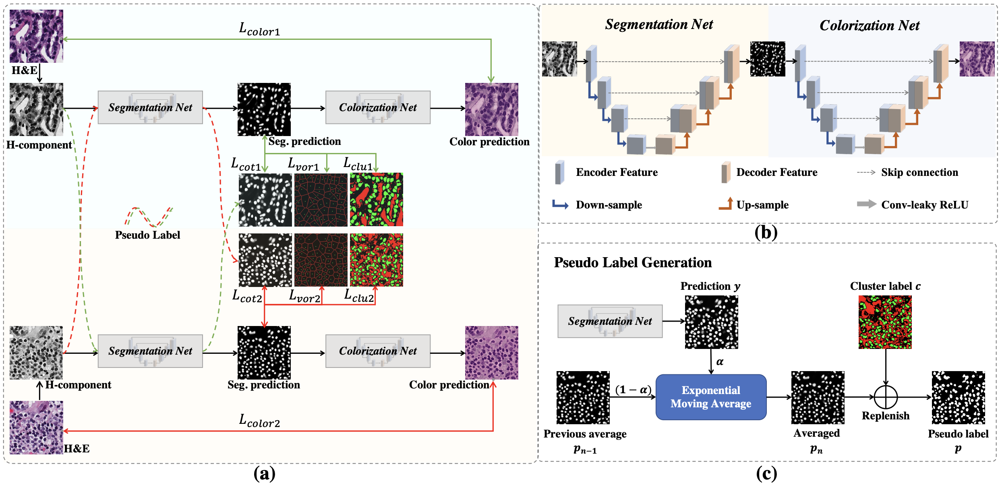

# SC-Net
This is the official code for our MedIA paper:

> [Nuclei Segmentation with Point Annotations from Pathology Images via Self-Supervised Learning and Co-Training](https://arxiv.org/abs/2202.08195) <br>
> Yi Lin*, Zhiyong Qu*, Hao Chen, Zhongke Gao, Yuexiang Li, Lili Xia, Kai Ma, Yefeng Zheng, Kwang-Ting Cheng

## Highlights
<p align="justify"> 
In this work, we propose a weakly-supervised learning method for nuclei segmentation that only requires point annotations for training. The proposed method achieves label propagation in a coarse-to-fine manner as follows. First, coarse pixel-level labels are derived from the point annotations based on the Voronoi diagram and the k-means clustering method to avoid overfitting. Second, a co-training strategy with an exponential moving average method is designed to refine the incomplete supervision of the coarse labels. Third, a self-supervised visual representation learning method is tailored for nuclei segmentation of pathology images that transforms the hematoxylin component images into the H&E stained images to gain better understanding of the relationship between the nuclei and cytoplasm. 

[comment]: <> ()

<div align="center">
(a) The pipeline of the proposed method; (b) The framework of SC-Net; (c) The process of pseudo label generation. 
</div> 

### Using the code
Please clone the following repositories:
```
git clone https://github.com/hust-linyi/SC-Net.git
```

### Requirement
```
pip install -r requirements.txt
```

### Data preparation
#### Download
1. **MoNuSeg**  [Multi-Organ Nuclei Segmentation dataset](https://monuseg.grand-challenge.org)
2. **CPM**  [Computational Precision Medicine dataset](https://drive.google.com/drive/folders/1sJ4nmkif6j4s2FOGj8j6i_Ye7z9w0TfA)

#### Pre-processing
Please refer to [dataloaders/prepare_data.py](https://github.com/hust-linyi/SC-Net/blob/main/dataloaders/prepare_data.py) for the pre-processing of the datasets.

### Training
1. Configure your own parameters in [opinions.py](https://github.com/hust-linyi/SC-Net/blob/main/options.py), including the dataset path, the number of GPUs, the number of epochs, the batch size, the learning rate, etc.
2. Run the following command to train the model:
```
python train.py
```

### Testing
Run the following command to test the model:
```
python test.py
```

## Citation
Please cite the paper if you use the code.
```bibtex
@article{lin2023nuclei,
  title={Nuclei segmentation with point annotations from pathology images via self-supervised learning and co-training},
  author={Lin, Yi and Qu, Zhiyong and Chen, Hao and Gao, Zhongke and Li, Yuexiang and Xia, Lili and Ma, Kai and Zheng, Yefeng and Cheng, Kwang-Ting},
  journal={Medical Image Analysis},
  pages={102933},
  year={2023},
  publisher={Elsevier}
}
```
